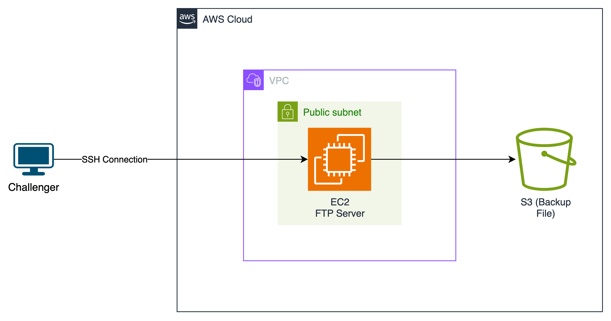

# MonPremierLAB - Configuration d'un Serveur FTP Sécurisé pour NaBysso

## Bienvenue
Bienvenue dans ce challenge d'administration système ! En tant qu'administrateur système chez NaBysso, vous êtes chargé de mettre en place une solution FTP sécurisée sur une instance Amazon Linux préconfiguée.

## Prérequis
- Connaissance de base des commandes Linux
- Un client FTP (FileZilla, WinSCP, ou autre)
- Un éditeur de texte (vim, nano)
- Un terminal SSH
- Accès à AWS (optionnel)

## Qu'est-ce qu'un serveur FTP ?
Le FTP (File Transfer Protocol) est un protocole standard d'Internet permettant le transfert de fichiers entre un client et un serveur sur un réseau informatique.

### Caractéristiques principales
- **Transfert de fichiers** : Permet l'upload et le download de fichiers
- **Architecture client-serveur** : Fonctionne avec un serveur central et des clients FTP
- **Authentification** : Gère les accès via un système d'utilisateurs/mots de passe
- **Gestion des droits** : Contrôle les permissions d'accès aux fichiers et répertoires

### Fonctionnement
1. **Connexion** : Le client se connecte au serveur (port 21 par défaut)
2. **Authentification** : L'utilisateur fournit ses identifiants
3. **Navigation** : Parcours des répertoires autorisés
4. **Transfert** : Échange de fichiers via un canal de données (port 20 ou ports passifs)

### Types de connexions
- **FTP actif** : Le serveur initie la connexion de données
- **FTP passif** : Le client initie la connexion de données (plus sécurisé)

### Contexte
NaBysso, entreprise de développement logiciel en pleine croissance, est composée de trois départements :
- **Développement** : 10 développeurs travaillant sur du code source sensible
- **Marketing** : 5 personnes gérant les supports de communication
- **RH** : 4 ressources manipulant des données confidentielles

### Problématique
Actuellement :
- Chaque équipe stocke ses fichiers localement sans sauvegarde centralisée
- Aucune gestion des accès ni traçabilité
- Risques élevés de fuites de données sensibles
- Difficultés de collaboration entre les départements
- Pas de politique de quota ou de rétention

## Le challenge
En tant qu'administrateur système, vous devez sécuriser et centraliser le partage de fichiers :

1. **Configuration du serveur VSFTPD (Very Secure FTP Daemon)**
   - Installation et configuration sécurisée
   - Gestion des connexions FTP
   - Mise en place de la journalisation

2. **Gestion des accès**
   - Structure de répertoires par département
   - Permissions et droits d'accès spécifiques
   - Isolation des données sensibles

3. **Optimisation des ressources**
   - Quotas de stockage par département
   - Surveillance de l'utilisation
   - Gestion des sauvegardes

4. **Challenge Supplémentaire : Intégration Cloud**
   - Sauvegarde automatique sur un Bucket Amazon S3

> **⚠️ Note importante sur la sécurité en production**
>
> Ce lab utilise une configuration FTP simplifiée à des fins pédagogiques. En production, il n'est pas recommandé d'exposer directement un serveur FTP sur Internet pour des raisons de sécurité.
>
> **Approches recommandées en production :**
> - Utiliser SFTP (SSH File Transfer Protocol) au lieu de FTP
> - Mettre en place un VPN pour accéder au serveur de fichiers
> - Utiliser AWS Transfer Family pour un service de transfert de fichiers géré et sécurisé
> - Implémenter une solution de stockage objet comme AWS S3 avec des accès pré-signés
>
> Ces solutions offrent un niveau de sécurité plus élevé et sont mieux adaptées à un environnement de production.

### Environnement de travail
Pour réaliser ce challenge, vous avez plusieurs options :

1. **Environnement Local**
   - Utilisez une machine virtuelle locale (VirtualBox, VMware)
   - Installez Amazon Linux 2023 ou une distribution Linux de votre choix
   - Configurez les ports nécessaires (20, 21 et ports passifs FTP 30000-30100)

2. **Cloud AWS**
   - Utilisez le template CloudFormation fourni (`infrastructure/ftp-server-infra.yml`)
   - **Important** : Ce template doit être déployé dans la région **us-west-2**
   - Il déploiera automatiquement dans votre compte AWS :
     - Un VPC avec un sous-réseau public
     - Une instance Amazon Linux 2023
     - Un volume EBS de 50 Go
     - Les Security Groups pour une instance de machine virtuelle sur laquelle tournera votre serveur FTP
     - Les ressources IAM nécessaires

3. **Sandbox MonPremierLab**
   - Si vous n'avez pas de compte AWS, vous pouvez contacter notre support via monpremierlab@gmail.com 
   - Nous vous fournirons un accès à un environnement préconfiguré pour ce lab
   - Durée d'accès : 2 heures
  
#### Architecture de votre infrastructure sur AWS
  

> **Note** : Les instructions de ce lab sont basées sur Amazon Linux 2023, mais peuvent être adaptées à d'autres distributions Linux.

## Résultat attendu
Votre serveur FTP doit répondre aux exigences suivantes :

- Structure de répertoires :
  ```
  /data/ftp/
  ├── development/
  ├── marketing/
  └── hr/
  ```
- Permissions spécifiques par département
- Quotas de stockage (5GB/département)
- Logs de connexion et d'activité
- Documentation de votre configuration

## Où tout trouver
### Documentations officielles

- **VSFTPD** :
  - [Manuel officiel](https://security.appspot.com/vsftpd.html)
  - [Page man](https://man.cx/vsftpd.conf(5))
  - [Wiki Archlinux VSFTPD](https://wiki.archlinux.org/title/Very_Secure_FTP_Daemon)

- **Commandes Linux utiles** :
  - `useradd` : [Documentation](https://man7.org/linux/man-pages/man8/useradd.8.html)
  - `chmod` : [Guide des permissions](https://man7.org/linux/man-pages/man1/chmod.1.html)
  - `chown` : [Documentation](https://man7.org/linux/man-pages/man1/chown.1.html)
  - `quota` : [Guide quotas](https://man7.org/linux/man-pages/man1/quota.1.html)
  
- `infrastructure/` : Ressources pour le déploiement
  - `nabysso-ftp-infra.yml` : Template CloudFormation AWS
  - `README.md` : Guide de déploiement

- `scripts/` : Scripts d'automatisation
  - `create_users.sh` : Création des utilisateurs et groupes
  - `setup_vsftpd.sh` : Configuration initiale du serveur
  - `configure_quotas.sh` : Mise en place des quotas
  - `setup_backup.sh` : Configuration des sauvegardes

- `config/` : Fichiers de configuration
  - `vsftpd.conf` : Template de configuration VSFTPD
  - `groups.conf` : Configuration des groupes utilisateurs
  - `quotas.conf` : Configuration des quotas

- `tests/` : Scripts de validation
  - `test_ftp_access.sh` : Test des accès FTP
  - `test_permissions.sh` : Vérification des permissions
  - `test_quotas.sh` : Validation des quotas


## Construire votre projet

### Étape 1 : Connexion à l'instance (⏱️ ~5 minutes)
Si vous utilisez l'environnement AWS ou la Sandbox MonPremierLab, connectez-vous à l'instance via SSH :
```bash
ssh -i ./credentials/MPL-KeyPairLab.pem ec2-user@<IP-FOURNIE>
```

### Points de contrôle - Étape 1
✓ La connexion SSH est établie
✓ Vous avez accès à la ligne de commande
✓ La clé SSH est correctement utilisée

### Étape 2 : Vérification de l'environnement distant (⏱️ ~5 minutes)
```bash
# Vérifiez l'environnement de travail
pwd
ls -la
```

### Étape 3 : Transfert des fichiers (⏱️ ~10 minutes)
Une fois connecté, transférez les fichiers nécessaires sur votre instance :

```bash
# Depuis un nouveau terminal sur votre machine locale
scp -i ./credentials/MPL-KeyPairLab.pem -r ./scripts ./config ./tests ec2-user@<IP-FOURNIE>:~
```

Dans le terminal SSH connecté au serveur, vérifiez que les fichiers ont été correctement transférés :
```bash
ls -la ~/scripts ~/config ~/tests
```

### Points de contrôle - Étape 3
✓ Les fichiers sont correctement transférés
✓ La structure des répertoires est conforme
✓ Les permissions des fichiers sont correctes

### Étape 4 : Préparation des scripts
Avant d'exécuter les scripts fournis, vous devez les rendre exécutables :
```bash
# Rendez tous les fichiers .sh du dossier scripts exécutables
chmod +x ./scripts/*.sh
```

### Étape 5 : Installation des packages nécessaires
Assurez-vous que tous les outils requis sont installés :
```bash
# Mettre à jour les packages
sudo dnf update -y

# Installer VSFTPD et les outils de gestion des quotas
sudo dnf install -y vsftpd quota
```

### Étape 6 : Configuration initiale de VSFTPD (⏱️ ~20 minutes)

1. Sauvegardez d'abord la configuration par défaut :
```bash
# Créer une sauvegarde du fichier de configuration original
sudo cp /etc/vsftpd/vsftpd.conf /etc/vsftpd/vsftpd.conf.bak
```

2. Examinez le fichier de configuration fourni :
```bash
# Prenez le temps d'analyser le fichier de configuration
cat ./config/vsftpd.conf
```

Le fichier de configuration est structuré en plusieurs sections :
- Sécurité niveau 1 : Configuration de base (accès anonyme, chroot)
- Sécurité niveau 2 : Isolation des utilisateurs
- Sécurité niveau 4 : Configuration des logs
- Configuration du mode passif

3. Remplacez l'IP publique dans le fichier de configuration :
```bash
# Récupérez l'IP publique de votre instance
PUBLIC_IP=$(curl http://checkip.amazonaws.com)

# Remplacez la variable ${PUBLIC_IP} dans le fichier de configuration
sed "s/\${PUBLIC_IP}/$PUBLIC_IP/" ./config/vsftpd.conf > vsftpd.conf.tmp
sudo mv vsftpd.conf.tmp /etc/vsftpd/vsftpd.conf
```

4. Sauvegardez la configuration par défaut :
```bash
# Sauvegardez la configuration par défaut de VSFTPD
sudo cp /etc/vsftpd/vsftpd.conf /etc/vsftpd/vsftpd.conf.orig
```

5. Redémarrez le service pour appliquer les modifications :
```bash
sudo systemctl restart vsftpd
```

6. Vérifiez que le service est bien démarré :
```bash
sudo systemctl status vsftpd
```

### Points de contrôle - Étape 6
✓ Le fichier vsftpd.conf a été analysé et compris
✓ L'IP publique a été correctement remplacée
✓ Le service VSFTPD est en cours d'exécution
✓ Les tests de connexion sont positifs

### Étape 7 : Structure des répertoires et permissions

1. **Création de la structure de base**
```bash
# Création du répertoire principal
sudo mkdir -p /data/ftp

# Création des répertoires par département
sudo mkdir -p /data/ftp/{development,marketing,hr}
```

2. **Configuration des permissions de base**
```bash
# Le répertoire principal doit appartenir à root pour chroot
sudo chown root:root /data/ftp
sudo chmod 755 /data/ftp

# Les répertoires des départements doivent aussi appartenir à root
sudo chown root:root /data/ftp/development
sudo chown root:root /data/ftp/marketing
sudo chown root:root /data/ftp/hr

sudo chmod 755 /data/ftp/development
sudo chmod 755 /data/ftp/marketing
sudo chmod 755 /data/ftp/hr
```

### Étape 8 : Création et configuration des utilisateurs

> **Note**: Le fichier `scripts/create_users.sh` vous donne plus d'information sur le
> processus de création des utilisateurs. Vous pouvez vous y référer. 

1. **Création des utilisateurs par département**
```bash
# Exemple pour un utilisateur du département development
# Créer le répertoire upload de l'utilisateur nommé justin
sudo mkdir -p /data/ftp/development/justin/upload

# Créer l'utilisateur avec son home dans le dossier upload
sudo useradd -d /data/ftp/development/justin/upload -s /sbin/nologin justin

# Ajouter l'utilisateur à la liste vsftpd
sudo echo "justin" | sudo tee -a /etc/vsftpd/user_list

# Configuration des permissions
sudo chown root:root /data/ftp/development/justin
sudo chmod 755 /data/ftp/development/justin

sudo chown justin:justin /data/ftp/development/justin/upload
sudo chmod 700 /data/ftp/development/justin/upload
```

2. **Vérification des permissions**
```bash
# Vérifier la structure du dossier utilisateur
ls -la /data/ftp/development/justin
# Doit montrer : propriétaire root:root avec droits 755

ls -la /data/ftp/development/justin/upload
# Doit montrer : propriétaire justin:justin avec droits 700
```

### Étape 9 : Test et Validation

1. **Test avec FileZilla**
   FileZilla est un client FTP gratuit et open-source qui offre une interface graphique intuitive pour les transferts de fichiers.

   Configuration de la connexion :
   - Hôte : sftp://<votre-ip>
   - Port : 21
   - Type d'authentification : Normale
   - Identifiant : votre_utilisateur
   - Mot de passe : votre_mot_de_passe

   Étapes de test :
   1. Ouvrez FileZilla
   2. Entrez les informations de connexion dans la barre rapide en haut
   3. Cliquez sur "Connexion rapide"
   4. Vérifiez que vous pouvez voir le dossier 'upload'
   5. Essayez de téléverser un fichier test
   6. Vérifiez que vous ne pouvez pas sortir du répertoire assigné

2. **Vérification des logs**
```bash
# Surveillance des connexions en temps réel
sudo tail -f /var/log/vsftpd.log
```

3. **Résolution des problèmes courants**
- Si erreur 500 : Vérifier que le dossier parent appartient à root
- Si erreur 550 : Vérifier les permissions du dossier upload
- Si erreur de connexion : Vérifier le pare-feu et les ports (20, 21)

### Étape 10 : Configuration des quotas (Optionnel)

1. **Installation des outils de quota**
```bash
sudo dnf install -y quota
```

2. **Configuration du système de fichiers**
```bash
# Modifier /etc/fstab pour ajouter les options de quota
sudo sed -i 's/defaults/defaults,usrquota,grpquota/' /etc/fstab

# Remonter le système de fichiers
sudo mount -o remount /data
```

3. **Activation des quotas**
```bash
# Initialisation des quotas
sudo quotacheck -cugm /data
sudo quotaon -v /data

# Configuration des limites (exemple : 5GB)
sudo setquota -u justin 5242880 5242880 0 0 /data
```

### Étape 11 : Sauvegardes (Optionnel)

**Qu'est-ce qu'Amazon S3 ?**
Amazon Simple Storage Service (S3) est un service de stockage d'objets qui offre une scalabilité, une disponibilité des données, une sécurité et des performances de pointe. Il permet de stocker et de protéger n'importe quelle quantité de données pour différents cas d'utilisation comme :
- Les sauvegardes et restaurations
- L'archivage des données
- Les sites web statiques
- Les applications natives cloud

**Objectif :** Configurez une sauvegarde automatique des fichiers FTP vers Amazon S3.

#### Prérequis
- Un compte AWS avec accès à S3
- Les informations d'identification IAM appropriées
- AWS CLI installé sur l'instance

#### Instructions de configuration

1. **Créer un bucket S3**
   - Nom suggéré : `nabysso-backup-<votre-identifiant>`
   - Région : celle la plus proche de votre instance
   - Configuration recommandée : 
     - Versioning activé
     - Chiffrement côté serveur
     - Politique de cycle de vie pour les anciennes sauvegardes

2. **Configuration de l'AWS CLI**
   ```bash
   # Installation de la commande AWS `AWS CLI` (si non installé)
   sudo dnf install -y aws-cli

   # Vérification que le profil IAM est bien attaché
   aws sts get-caller-identity
   ```

   > **Note**: Si un profil IAM est attaché à votre instance avec les bonnes permissions S3, 
   > vous n'avez pas besoin d'exécuter `aws configure`. Les credentials sont automatiquement 
   > gérés par le service de métadonnées AWS.

3. **Script de sauvegarde**
   Créez un script nommé `backup_to_s3.sh` :
   ```bash
   #!/bin/bash
   
   # Variables à configurer
   BACKUP_DIR="/data/ftp"
   S3_BUCKET="votre-bucket-s3"
   BACKUP_NAME="ftp_backup_$(date +%Y%m%d_%H%M%S).tar.gz"

   # Création de la sauvegarde
   echo "Création de la sauvegarde..."
   tar -czf "/tmp/$BACKUP_NAME" "$BACKUP_DIR"

   # Envoi vers S3
   echo "Envoi vers S3..."
   aws s3 cp "/tmp/$BACKUP_NAME" "s3://$S3_BUCKET/backups/"

   # Nettoyage
   rm "/tmp/$BACKUP_NAME"
   ```

4. **Automatisation avec Cron**
   ```bash
   # Éditer le crontab
   crontab -e

   # Ajouter la ligne suivante pour une sauvegarde quotidienne à 2h du matin
   0 2 * * * /scripts/backup_to_s3.sh
   ```

#### Validation
- Vérifiez que le script fonctionne manuellement
- Confirmez que les sauvegardes apparaissent dans le bucket S3
- Testez la restauration d'une sauvegarde

#### Points bonus
- Mettre en place une rotation des sauvegardes
- Ajouter une notification en cas d'échec
- Implémenter un système de surveillance des tailles de sauvegarde

## Guide de dépannage

### Problèmes courants
| Problème | Cause possible | Solution |
|----------|----------------|----------|
| Connexion FTP refusée | Port 21 bloqué | Vérifier les security groups AWS |
| Erreur passive mode | IP incorrecte | Vérifier pasv_address dans vsftpd.conf |
| Permission denied | Droits incorrects | Vérifier les permissions avec ls -la |
| Service ne démarre pas | Erreur de configuration | Vérifier /var/log/messages |
| Timeout connexion | Règles firewall | Vérifier les security groups et iptables |

### Commandes utiles de diagnostic
```bash
# Vérifier le status du service
sudo systemctl status vsftpd

# Consulter les logs en temps réel
sudo tail -f /var/log/vsftpd.log

# Tester la configuration
sudo vsftpd -olisten=NO /etc/vsftpd/vsftpd.conf

# Vérifier les ports en écoute
sudo netstat -tulpn | grep vsftpd

# Tester la connexion locale
ftp localhost
```

### Dépannage des problèmes de chroot

Si vous rencontrez des erreurs 500 lors de la connexion FTP, vérifiez ces points :

1. **Structure des permissions**
   ```bash
   # Vérifiez le propriétaire et les droits du dossier parent
   ls -ld /chemin/vers/dossier_utilisateur
   # Doit afficher : drwxr-xr-x root root
   
   # Vérifiez le propriétaire et les droits du dossier upload
   ls -ld /chemin/vers/dossier_utilisateur/upload
   # Doit afficher : drwxr-xr-x utilisateur utilisateur
   ```

2. **Configuration vsftpd**
   Vérifiez dans `/etc/vsftpd/vsftpd.conf` :
   ```ini
   chroot_local_user=YES
   allow_writeable_chroot=YES
   ```

3. **Logs d'erreur courants**
   - "500 OOPS: vsftpd: refusing to run with writable root inside chroot()"
     → Le dossier parent n'appartient pas à root
   - "500 OOPS: cannot change directory"
     → Problème de permissions sur le dossier upload

## Des feedback pour nous?
Vos retours sont précieux ! Partagez votre expérience sur :
- La clarté des instructions
- Les difficultés avec Amazon Linux
- Les suggestions d'amélioration

Ce lab fait partie de la série MonPremierLab - Formation pratique en administration système.

Cet atelier est entièrement gratuit. N'hésitez pas à le partager avec toute personne susceptible d'en bénéficier.